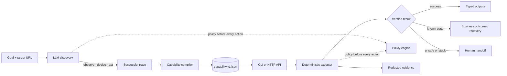
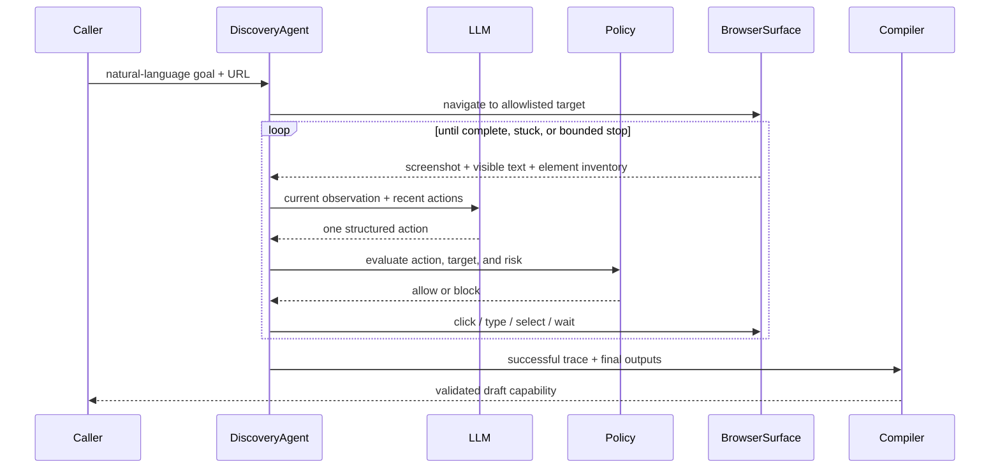

# UI Capability Runtime

**An LLM discovers a UI workflow once. A typed capability replays it afterward with no model in the decision loop.**

This repository implements the backend integration layer that gives an AI agent controlled “hands” inside applications with no API. The concrete demo prepares a fictional credit-union transfer through a deliberately legacy-shaped web UI: server-rendered pages, an iframe, nested tables, duplicate labels, and no test IDs.

> **Safety invariant:** automation may prepare the transfer and reach `Transfer Review`; it may never click `Submit Transfer`.

## What exactly is this?

This is a standalone Node.js/TypeScript automation runtime, not a browser extension, ChatGPT plugin, or library that must be embedded before it can run. It can be operated in two ways:

- **CLI:** learn a new workflow with `discover`, replay a saved workflow with `replay`, or validate an artifact.
- **Local HTTP service:** publish saved capabilities as a typed catalog and invoke them through an API; the service also hosts the reviewer dashboard.

The runtime launches and controls its own Playwright browser. The target application is a separate website it visits; that site does not import this project and does not need an API. The included Northstar site is only a fictional, local target for a reproducible demonstration.

| Running component | Purpose | Needs an LLM? |
|---|---|---|
| Target application | The UI being operated; use the bundled demo or supply another URL. | No |
| Discovery CLI | Observes the live UI, asks the model for one action at a time, and compiles a successful run. | Yes |
| Capability artifact | Versioned JSON containing typed inputs/outputs, saved actions, locators, checks, policy, and runtime handlers. | No |
| Replay CLI / capability API | Executes the artifact deterministically and returns a structured result. | No |
| Dashboard | Explains the system and invokes already-saved capabilities through the local API. | No |

The dashboard is a demonstration and invocation portal; new workflow capture currently starts from the CLI. This repository is a complete local vertical slice, but it is not a hosted multi-user product: production authentication, encrypted evidence storage, distributed workers, and native desktop adapters are deliberately outside the assignment scope. See [REPORT.md](REPORT.md) for the deeper architecture and trade-offs.

## End-to-end operating flow

1. Start or identify the target UI and obtain its entry URL.
2. Put an OpenAI API key in the local, gitignored `.env` file.
3. Run `discover` with only a natural-language goal and target URL.
4. The LLM observes and operates the live UI until it reaches the requested success state; every action remains policy-checked.
5. The compiler converts the successful trace into a reviewable `capability.v1.json`, replacing invocation-specific values with typed parameters.
6. Review and eventually approve the artifact. This demo leaves new artifacts in `draft` status intentionally.
7. Invoke the capability repeatedly through `replay` or `POST /capabilities/:id/invoke`, supplying new arguments. These calls do not use the LLM.
8. Receive `success`, a known `business_outcome`, `escalated`, or a structured `failure`, together with evidence references.

## The 60-second mental model



The model is present only on the left side. Once the successful trace is compiled, every invocation follows the saved steps, locators, checks, recovery rules, and output extractors. The target application never needs to expose an API.

## What is real in this vertical slice

| Concern | Implemented proof |
|---|---|
| Goal-driven computer use | A genuine image-capable LLM run operates the live target from only a goal and URL. |
| Reviewable capability | Typed inputs, outputs, version, locator bundles, checkpoints, policy, provenance, recoveries, and interventions are serialized. |
| No-model production path | CLI and HTTP invocations construct the deterministic executor without constructing an LLM client. |
| Runtime outcomes | Success, `MEMBER_NOT_FOUND`, validation rejection, bounded transient recovery, escalation, and hard failure are distinct results. |
| Human control transfer | Automation pauses, a human receives the same browser session, actions are recorded, and resume is checkpoint-gated. |
| Safety and evidence | Origin/route/action/risk allowlists, target fingerprinting, irreversible-action blocking, redaction, logs, and screenshots. |

The recorded artifact is workflow- and application-family-specific; the runtime itself is not Northstar-specific. Discovery starts with a target-derived generic allowlist. After observing the live page, an application-profile registry selects a known family profile when exactly one matches, or compiles a conservative generic-web capability from the observed title and origin. Known profiles add business-specific schemas, outcomes, recoveries, interventions, and safety rules; the generic fallback never invents exceptional states that were not observed.

This distinction is intentional. The brief asks for implementation against one concrete surface, with core abstractions that do not block other applications—not a claim that one recording works on every website. `tests/generic-web-discovery.integration.test.ts` proves the same discovery, compiler, and no-model executor on an unrelated Ticket Desk app without adding a Ticket Desk profile. A real deployment would register reviewed family profiles as applications are onboarded, while leaving the agent loop, artifact schema, executor, policy engine, and API unchanged.

## Installation and credentials

Prerequisites:

- Node.js 22 or newer
- a Chromium-compatible browser installed by Playwright
- an OpenAI API key only for the genuine discovery command

```bash
npm install
npx playwright install chromium
cp .env.example .env
```

Windows PowerShell equivalent:

```powershell
Copy-Item .env.example .env
```

Edit `.env` locally:

```dotenv
OPENAI_API_KEY=your_key_here
OPENAI_MODEL=gpt-5.6-luna
```

`.env` is ignored by Git. The key is read only by `discover`; `replay`, the capability API, the dashboard, validation, and the automated tests can run without it. There is no target-application authentication in the fictional demo. For a real authenticated application, Playwright session/bootstrap and credential-vault integration would be an onboarding concern; credentials must never be stored in the capability JSON or evidence.

## Five-minute visual demo

Start the fictional target in terminal one:

```bash
npm run target -- --scenario happy
```

Start the capability API and dashboard in terminal two:

```bash
npm run api -- --allow-draft
```

Open [http://127.0.0.1:4312](http://127.0.0.1:4312). The first screen shows the complete execution pipeline, the selected capability's typed contract, and a working invocation form. Enter member `M-20081`, choose `checking` → `savings`, enter amount `75`, and click **Invoke deterministic replay**. The result panel returns typed outputs and evidence references.

`--allow-draft` is an explicit local-demo exception. Without it, the API refuses to invoke a freshly compiled `draft` artifact.

## Reproduce the full lifecycle

### 1. Verify the repository without live services

```bash
npm run check
npm run cli -- --help
```

The test suite includes real headless-browser runs for successful replay, member-not-found, transient recovery, permission escalation, same-session human takeover/resume, and goal-only discovery with a deterministic scripted model. The scripted model is a test fixture, not the required live discovery evidence.

### 2. Start the target application

In terminal one:

```bash
npm run target -- --scenario happy
```

The fictional operations console is then available at `http://127.0.0.1:4310/ops`.

### 3. Run genuine LLM discovery

Put `OPENAI_API_KEY` and an image-capable structured-output `OPENAI_MODEL` in the untracked `.env` file. The example uses `gpt-5.6-luna`, the lowest-cost model that completed this workflow reliably during development. Then run in terminal two:

```bash
npm run discover -- \
  --target http://127.0.0.1:4310/ops \
  --goal "Prepare a $125.50 internal transfer for member M-10042 from checking to savings and stop at the review page." \
  --output evidence/prepare-internal-transfer.v1.json \
  --headed
```

For a reviewer-friendly visual run, add `--slow-mo 1000 --keep-open`. The CLI prints each model decision to stderr, slows browser actions to one second, and leaves the verified final page open until Enter is pressed.

Discovery receives only the goal and target. The compiler infers typed inputs from the goal and successful trace, replaces concrete values with `input` references, validates checkpoint phrases against observed states, and writes a `draft` artifact. Model responses are requested with storage disabled. Raw sample member IDs and amounts are not persisted in the artifact.

### 4. Replay without an LLM

Keep the happy target running and invoke the saved capability with different inputs:

```bash
npm run replay -- \
  --artifact evidence/prepare-internal-transfer.v1.json \
  --args '{"member-id":"M-20081","from-account":"checking","to-account":"savings","amount":75}'
```

Add `--headed --slow-mo 1000 --keep-open` to watch deterministic replay step by step. Progress is written to stderr so the final structured JSON on stdout remains machine-readable.

The replay command never constructs an LLM client. A successful result contains the typed extracted outputs and evidence references.

### 5. Known business outcome

```bash
npm run replay -- \
  --artifact evidence/prepare-internal-transfer.v1.json \
  --args '{"member-id":"M-99999","from-account":"checking","to-account":"savings","amount":75}'
```

Expected result: `business_outcome` with code `MEMBER_NOT_FOUND`, not a thrown automation error.

### 6. Agent-facing capability API

Keep the happy target running, then start the local API in another terminal. Compiled artifacts are drafts, so the demo requires an explicit opt-in; without `--allow-draft`, draft invocation returns `artifact_not_approved`.

```bash
npm run api -- --allow-draft
```

Discover the typed catalog:

```bash
curl http://127.0.0.1:4312/capabilities
```

Invoke the saved capability by ID. This endpoint constructs the deterministic executor, not an LLM client:

```bash
curl -X POST http://127.0.0.1:4312/capabilities/prepare-internal-transfer-to-review/invoke \
  -H "content-type: application/json" \
  -d '{"args":{"member-id":"M-20081","from-account":"checking","to-account":"savings","amount":75}}'
```

The API binds to loopback by default, returns the same tagged result union as the CLI, and writes redacted replay evidence under `evidence/api/`. It is a local demonstration surface, not an authenticated production service.

### 7. Declared transient recovery

Restart terminal one with:

```bash
npm run target -- --scenario transient
```

Run the same replay command. The executor detects the declared temporary validation state, clicks the artifact's `Retry Validation` recovery action once, verifies its checkpoint, and completes.

### 8. Same-session human handoff

Restart terminal one with:

```bash
npm run target -- --scenario permission
```

Then run replay in headed handoff mode:

```bash
npm run replay -- \
  --artifact evidence/prepare-internal-transfer.v1.json \
  --args '{"member-id":"M-30077","from-account":"checking","to-account":"savings","amount":80}' \
  --handoff
```

Open the printed operator URL, take control, click `Apply Supervisor Override` in the already-open target browser, and request resume. The coordinator records redacted human events, verifies the declared resume checkpoint, returns the controller lease to automation, and the original replay finishes.

For CI and evidence regeneration, `npm run demo:handoff -- evidence/prepare-internal-transfer.v1.json` exercises the identical controller-lease and same-`BrowserContext` path with a scripted operator callback. It is explicitly a simulation; the command above is the human-operated path.

### Validate an artifact without running it

```bash
npm run cli -- validate --artifact evidence/prepare-internal-transfer.v1.json
```

### Use another website

The discovery command is not tied to the bundled Northstar URL:

```bash
npm run discover -- \
  --target https://your-approved-target.example/start \
  --goal "Describe the desired workflow and its stopping point" \
  --output evidence/my-capability.v1.json
```

Discovery begins with a generic policy restricted to the supplied origin. After the first observation, the profile registry selects a reviewed application-family profile if one matches; otherwise it uses a conservative generic-web profile learned from the observed origin and page title. The resulting artifact is specific to that workflow and application family—it is not a universal macro that can be replayed unchanged on unrelated sites.

The automated Ticket Desk integration test demonstrates the generic path on a second website without defining a Ticket Desk profile:

```bash
npx vitest run tests/generic-web-discovery.integration.test.ts
```

Generic discovery supports the current browser action vocabulary: navigation, click, text entry, select, wait, and text extraction. A new application can use that path immediately for an ordinary happy-path workflow. Production-grade business outcomes, recoveries, interventions, sensitive-field schemas, and application-specific blocked actions should be added through a reviewed profile rather than inferred from a single successful run.

## Execution logic

### Discovery: model-guided, policy-constrained



The model selects only IDs from the current element inventory. It cannot bypass policy, invent executable selectors, or declare success with output elements that were not observed. The compiler then replaces matching concrete goal values with canonical input references and rejects ambiguous or incomplete traces.

### Replay: deterministic state machine

For every invocation, the executor performs the same guarded sequence:

1. Validate supplied arguments against the artifact's typed contract.
2. Navigate only within the artifact and runtime allowlists.
3. Verify the saved application fingerprint before workflow actions.
4. Check preconditions, resolve a unique locator, enforce policy, and perform one saved action.
5. Evaluate known business outcomes, bounded recovery handlers, and intervention states.
6. Verify step postconditions and the final success checkpoint.
7. Extract typed outputs and return a tagged result with redacted evidence references.

No replay branch asks a model what to do next.

## Code map

Repository boundaries are intentional:

```text
.
├── src/                 shippable runtime; never imports demo or test code
│   ├── agent/           model-guided discovery
│   ├── artifact/        generic compiler and profile-registry primitives
│   ├── profiles/        reviewed application-family knowledge
│   ├── replay/          deterministic, model-free execution
│   └── ...              contracts, policy, surface, evidence, handoff, API
├── demo/targets/        external UIs operated by the runtime
│   ├── northstar/       primary deep banking workflow
│   └── ticket-desk/     unrelated generic-path proof
├── tests/               unit and browser/HTTP integration tests
│   └── fixtures/        test-only hand-authored capability
├── scripts/             reproducible verification and handoff demonstrations
├── evidence/            committed genuine discovery/replay proof
├── docs/                requirements, decisions, and build history
├── REPORT.md            assignment design write-up
└── .github/workflows/   clean-install CI
```

See [`src/README.md`](src/README.md), [`demo/README.md`](demo/README.md), and [`tests/README.md`](tests/README.md) for the dependency and testing boundaries.

| Module | Responsibility | Important boundary |
|---|---|---|
| [`src/agent/`](src/agent/) | Discovery loop and structured model provider | Model returns one action; policy remains external. |
| [`src/artifact/`](src/artifact/) | Capability compiler, profile registry, generic fallback, reviewed app-family profiles | Converts a successful trace into a typed contract and executable flow without hard-coding the target in the compiler. |
| [`src/contracts/`](src/contracts/) | Zod schemas for actions, capability, policy, and results | Rejects malformed artifacts and undeclared input references. |
| [`src/surface/`](src/surface/) | Browser-independent observation/action interface and Playwright adapter | Executor never stores Playwright objects in an artifact. |
| [`src/replay/`](src/replay/) | Input validation and deterministic state machine | Contains no LLM dependency or fallback reasoning. |
| [`src/policy/`](src/policy/) | Origin, route, action, target-text, and risk enforcement | Runs immediately before discovery, replay, and recovery actions. |
| [`src/handoff/`](src/handoff/) | Intervention queue, controller lease, operator console | Human takes over the original `BrowserContext`, not a fresh session. |
| [`src/api/`](src/api/) | Local catalog, JSON Schema projection, invocation API, dashboard | Thin adapter over the same replay executor used by the CLI. |
| [`src/profiles/`](src/profiles/) | Registered, reviewed application-family knowledge | Adds Northstar semantics without coupling the generic compiler or executor to the demo site. |
| [`src/evidence/`](src/evidence/) | Structured events, screenshots, hashes, and redaction | Redaction occurs before persistence. |
| [`demo/targets/`](demo/targets/) | Northstar and Ticket Desk target applications | External test surfaces; never imported by production runtime modules. |
| [`tests/`](tests/) | Contract, policy, browser, compiler, API, recovery, and handoff tests | Exercises real browser paths where behavior matters. |
| [`evidence/`](evidence/) | Committed genuine discovery and deterministic replay proof | Reviewer-facing evidence, not generated test fixtures. |

## Result contract

| Status | Meaning | Caller action |
|---|---|---|
| `success` | Checkpoint verified and typed outputs extracted | Continue the calling workflow. |
| `business_outcome` | A legitimate domain result such as `MEMBER_NOT_FOUND` | Handle as data, not as a crash. |
| `escalated` | Automation paused at a declared human intervention | Route the live session to an operator. |
| `failure` | Policy, target, locator, timeout, checkpoint, input, or surface failure | Inspect `stepId`, expected/observed state, retryability, and evidence. |

## Safety boundary

The demo may prepare a fictional internal transfer and reach its review page. The default policy does not permit automation to commit the transfer. Discovery and replay use the same policy engine. Secrets and raw sensitive values are not serialized into artifacts or logs.

## Running without live model services

Deterministic replay, policy tests, target application scenarios, artifact validation, and the scripted discovery/compiler integration test do not require an API key. Only creation of fresh genuine discovery evidence requires a live model call.

## Artifact lifecycle

Compiled artifacts start as `draft`. The schema reserves `verified` and `approved`, but this submission deliberately does not implement a review product or silently promote a discovery after one success. The local demo permits an explicit replay of a draft; a production policy would require repeated replay evidence followed by human approval before unattended use.

## Threat and trust boundaries

- Page text is observation data, never trusted instruction text.
- Discovery decisions and replay actions pass through the same policy engine.
- Locator candidates must resolve unambiguously; a weaker but unique fallback may be used, while ambiguous candidates are rejected.
- Coordinates are discovery fallbacks and cannot be used for deterministic text entry or output extraction.
- Operator takeover uses the original `BrowserContext`; a new session cannot satisfy the handoff contract.
- Evidence redaction happens before persistence.
