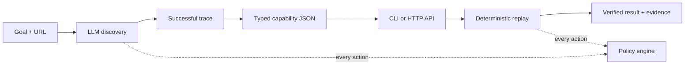

# UI Capability Runtime

**Use an LLM to discover a UI workflow once, compile it into a typed capability, then replay it deterministically with no model in the loop.**

This repository is a standalone Node.js/TypeScript runtime for operating applications that do not expose an API. It controls a browser through Playwright; the target website does not need to install or import anything.

The included demo prepares a fictional internal transfer in a legacy-style web application. Automation may reach **Transfer Review**, but policy prevents it from submitting the transfer.

## How it works



There are two operating paths:

- **Discovery:** the user supplies a natural-language goal and target URL. The model observes the live page and chooses one action at a time. Policy checks every action. A successful trace is compiled into a reviewable capability artifact.
- **Replay:** the CLI or local HTTP API accepts typed arguments and executes the saved steps, locators, checks, recoveries, and output extractors. No LLM client is created.

The browser dashboard invokes saved capabilities. Capturing a new workflow currently starts from the CLI.

## Quick start: watch a saved capability run

Requirements: Node.js 22+.

```bash
npm install
npx playwright install chromium
```

Start the fictional target application:

```bash
npm run target -- --scenario happy
```

In a second terminal, start the capability API and dashboard:

```bash
npm run api -- --allow-draft
```

Open [http://127.0.0.1:4312](http://127.0.0.1:4312), enter:

- member: `M-20081`
- from account: `checking`
- to account: `savings`
- amount: `75`

Click **Invoke deterministic replay**. The dashboard displays the typed result and evidence references. This path does not require an API key.

`--allow-draft` is an explicit demo exception. Without it, the service refuses to run a newly compiled artifact until it is approved.

## Full lifecycle

### 1. Configure live discovery

Copy the environment template:

```bash
cp .env.example .env
```

PowerShell:

```powershell
Copy-Item .env.example .env
```

Add an OpenAI API key and an image-capable model to the local `.env` file:

```dotenv
OPENAI_API_KEY=your_key_here
OPENAI_MODEL=your_model_here
```

The key is used only by `discover`. The `.env` file is excluded from Git.

### 2. Discover and compile a workflow

Keep the target application running, then execute:

```bash
npm run discover -- \
  --target http://127.0.0.1:4310/ops \
  --goal "Prepare a $125.50 internal transfer for member M-10042 from checking to savings and stop at the review page." \
  --output evidence/prepare-internal-transfer.v1.json \
  --headed
```

For a recording-friendly run, add `--slow-mo 1000 --keep-open`. The browser remains open at the verified final state until Enter is pressed.

Discovery receives only the goal and URL. The compiler turns the successful trace into a `draft` artifact containing typed inputs and outputs, parameterized actions, locator bundles, checkpoints, recovery rules, policy, and provenance.

### 3. Replay with new inputs

```bash
npm run replay -- \
  --artifact evidence/prepare-internal-transfer.v1.json \
  --args '{"member-id":"M-20081","from-account":"checking","to-account":"savings","amount":75}' \
  --headed --slow-mo 1000 --keep-open
```

When invoking `npm.cmd` from Windows PowerShell, escape the JSON quotes so they survive the `cmd.exe` argument boundary:

```powershell
npm.cmd run replay -- --artifact evidence/prepare-internal-transfer.v1.json --args '{\"member-id\":\"M-20081\",\"from-account\":\"checking\",\"to-account\":\"savings\",\"amount\":75}' --headed --slow-mo 1000 --keep-open
```

Replay is deterministic and does not call a model. Its structured result is one of:

| Status | Meaning |
|---|---|
| `success` | Final checkpoint verified; typed outputs extracted. |
| `business_outcome` | A legitimate domain result, such as `MEMBER_NOT_FOUND`. |
| `escalated` | Automation paused at a declared human intervention. |
| `failure` | A policy, target, locator, input, timeout, or checkpoint failed. |

### 4. Invoke through the HTTP API

With the target and API running:

```bash
curl http://127.0.0.1:4312/capabilities
```

```bash
curl -X POST http://127.0.0.1:4312/capabilities/prepare-internal-transfer-to-review/invoke \
  -H "content-type: application/json" \
  -d '{"args":{"member-id":"M-20081","from-account":"checking","to-account":"savings","amount":75}}'
```

The API exposes the same deterministic executor and tagged result contract as the CLI.

## Can it operate another website?

Yes, within a clear boundary: **the runtime is general, but each compiled capability is specific to one workflow and application family.** A capability recorded for Northstar cannot be replayed unchanged on an unrelated site.

To try another approved website:

```bash
npm run discover -- \
  --target https://your-approved-target.example/start \
  --goal "Describe the workflow and the exact stopping point" \
  --output evidence/my-capability.v1.json
```

The generic browser path supports navigation, clicking, text entry, selection, waiting, and text extraction. It restricts activity to the supplied origin and compiles what was observed during the successful run.

For production onboarding, an application profile should add reviewed knowledge such as input/output schemas, known business outcomes, recovery rules, human-intervention states, sensitive fields, and blocked actions. The core discovery loop, artifact schema, executor, policy engine, and API remain unchanged.

The second bundled target, Ticket Desk, verifies that the generic path is not coupled to the banking demo:

```bash
npx vitest run tests/generic-web-discovery.integration.test.ts
```

This project does not claim zero-configuration automation of every arbitrary public website. Authentication, CAPTCHAs, site terms, unfamiliar widgets, and destructive workflows require explicit onboarding and policy decisions.

## Safety and reliability

- Discovery and replay pass every action through the same policy engine.
- Origins, routes, action types, target text, and risk levels are allowlisted.
- Locators must resolve unambiguously; unexpected UI changes fail closed.
- Known business outcomes and bounded recoveries are distinct from automation failures.
- Human takeover preserves the original browser session and verifies a resume checkpoint.
- Evidence is redacted before persistence.
- Capability artifacts never contain API keys or target credentials.

## Repository map

```text
.
├── src/
│   ├── agent/       model-guided discovery
│   ├── artifact/    compiler and application-profile primitives
│   ├── replay/      deterministic, model-free executor
│   ├── policy/      action and risk enforcement
│   ├── surface/     browser abstraction and Playwright adapter
│   ├── handoff/     same-session human takeover
│   ├── evidence/    events, screenshots, hashes, and redaction
│   └── api/         capability catalog, invocation API, and dashboard
├── demo/targets/    Northstar and Ticket Desk target websites
├── tests/           unit and browser/HTTP integration tests
├── evidence/        committed discovery and replay proof
├── scripts/         verification and handoff demonstrations
└── REPORT.md        architecture, trade-offs, and production roadmap
```

Production runtime code under `src/` cannot import demo or test modules. Replay and API modules cannot import the model provider; repository-boundary tests enforce both rules.

More detail:

- [`REPORT.md`](REPORT.md): design decisions, safety model, failure handling, and production evolution
- [`src/README.md`](src/README.md): runtime module boundaries
- [`demo/README.md`](demo/README.md): target applications and scenarios
- [`tests/README.md`](tests/README.md): test strategy
- [`evidence/README.md`](evidence/README.md): genuine discovery and deterministic replay records

## Verification

Run the complete local check:

```bash
npm run check
npm run build
npm run verify:submission
```

CI performs a clean install, installs Chromium, and runs the same checks. Tests cover discovery/compiler behavior, successful replay, known business outcomes, transient recovery, policy rejection, human handoff, HTTP invocation, and repository boundaries.

## Scope

This repository is a complete local vertical slice for the assignment: CLI discovery, typed artifact compilation, deterministic replay, local API/dashboard, safety enforcement, evidence, recovery, and human handoff.

It is not a hosted multi-user product. Production authentication, credential-vault integration, encrypted evidence storage, distributed workers, native desktop adapters, and artifact approval UI are documented extension points rather than simulated features.
